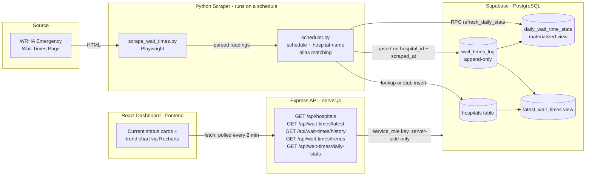

# Winnipeg ER Tracker

Real-time emergency room wait time tracking and analytics dashboard for the Winnipeg Regional Health Authority (WRHA). The app scrapes live wait-time data published by Shared Health Manitoba, stores a historical time series in Postgres, and serves a live dashboard with current status and trend charts for every WRHA emergency department and urgent care site.

## Key Features

- **Real-time wait-time metrics** — current wait time, patients waiting, and urgency status for every tracked hospital, sourced directly from the WRHA emergency wait times page.
- **Auto-refresh polling** — the dashboard polls the API every 2 minutes for the latest snapshot, so the "Current Status" view stays up to date without a manual refresh.
- **Trend visualization** — a multi-line chart (6h / 12h / 24h / 48h ranges) shows historical wait times per hospital, with per-hospital toggles and a custom tooltip.
- **Canonical hospital matching** — the scraper's raw facility names are normalized against an alias table before being matched to the canonical `hospitals` record, so a page copy change (e.g. "Health Sciences Centre - Adult" vs. "...Adult Emergency") doesn't spawn duplicate hospital rows.
- **Resilient error recovery** — scrape failures (site down, page structure changed, zero rows parsed) are caught and logged as sentinel rows in the database instead of crashing the scheduler, so gaps in the time series are visible rather than silent.

## Tech Stack

| Layer | Technology |
|---|---|
| Scraper | Python, [Playwright](https://playwright.dev/python/) (headless Chromium — navigation, DOM querying, and parsing) |
| Scheduling | Python, [`schedule`](https://schedule.readthedocs.io/) |
| Database | [Supabase](https://supabase.com/) (managed PostgreSQL), with a materialized view for daily aggregates |
| Backend API | Node.js, [Express](https://expressjs.com/), [Helmet](https://helmetjs.github.io/), `express-rate-limit`, `@supabase/supabase-js` |
| Frontend | [React 19](https://react.dev/), [Vite](https://vite.dev/) |
| Styling / UI | [Tailwind CSS v4](https://tailwindcss.com/), [shadcn/ui](https://ui.shadcn.com/), Radix UI primitives |
| Charts | [Recharts](https://recharts.org/) |

> **Note:** the scraper parses the page using Playwright's own DOM query API (`page.query_selector_all`) rather than BeautifulSoup — there's no `beautifulsoup4` dependency in this codebase. Flagging this in case BeautifulSoup is expected elsewhere in your toolchain; happy to add it if there's a reason to prefer it over Playwright's built-in querying.

## Architecture & Data Flow



1. **Scrape** — `scrape_wait_times.py` launches headless Chromium via Playwright, navigates to the WRHA emergency wait times page, and parses each hospital's row (facility name, patients waiting, raw wait-time string) into structured minutes (`parse_wait_minutes` handles both `"2h 15m"` and decimal formats like `"12.75 hrs"`).
2. **Store** — `scheduler.py` runs on an interval (`SCRAPE_INTERVAL_MINUTES`, default 30), resolves each scraped facility name to a canonical `hospitals.id` (via `HOSPITAL_NAME_ALIASES` and a cached lookup, inserting a stub row only for genuinely unknown facilities), and upserts one row per hospital into `wait_times_log`. Scrape failures are written as sentinel rows (`scrape_status = 'site_down' | 'parse_error'`) instead of being dropped, and the `daily_wait_time_stats` materialized view is refreshed via an RPC call after each successful cycle.
3. **Serve** — `server.js` is a read-only Express API that queries Supabase with the service-role key (never exposed to the browser) and exposes `/api/hospitals`, `/api/wait-times/latest`, `/api/wait-times/history`, `/api/wait-times/trends`, and `/api/wait-times/daily-stats`, all protected by Helmet, a CORS allowlist, and rate limiting.
4. **Display** — the React frontend talks only to the Express API (never directly to Supabase — see `frontend/src/lib/api.js`), polling `/api/wait-times/latest` every 2 minutes and re-fetching `/api/wait-times/trends` whenever the selected time range changes.

## Project Structure

```
Winnipeg_ER_Tracker/
├── scrape_wait_times.py     # Playwright scraper — reads live wait times from the WRHA site
├── scheduler.py              # Runs the scraper on an interval, upserts into Supabase
├── schema.sql                 # Supabase/Postgres schema: tables, indexes, views, RLS policies
├── functions.sql              # Postgres RPC function (refresh_daily_stats) used by the scheduler
├── server.js                  # Express API — reads Supabase, serves the frontend
├── requirements.txt            # Python dependencies
├── package.json                 # Node dependencies for the Express API
├── .env.example                  # Backend env var template
└── frontend/                      # Vite + React dashboard
    ├── src/
    │   ├── components/            # HospitalCard, WaitTimeTrendChart, shadcn/ui primitives
    │   ├── hooks/                  # useLatestWaitTimes, useTrends, useNow
    │   └── lib/                     # api.js (Express client), utils.js
    └── .env.local                   # Frontend env var (not committed)
```

## Local Setup

### Prerequisites

- Node.js 20+ and npm
- Python 3.10+
- A [Supabase](https://supabase.com/) project (free tier is sufficient)

### 1. Database

In the Supabase SQL editor, run `schema.sql` then `functions.sql`, in that order. This creates the `hospitals` and `wait_times_log` tables (seeded with the eight WRHA sites the scraper covers), the `daily_wait_time_stats` materialized view, the `latest_wait_times` view, row-level security policies, and the `refresh_daily_stats()` RPC function.

### 2. Backend (scraper + scheduler + API)

```bash
# From the project root
cp .env.example .env      # fill in SUPABASE_URL, SUPABASE_SERVICE_KEY, etc.

# Python: scraper + scheduler
pip install -r requirements.txt
playwright install chromium
python scheduler.py        # runs continuously, scraping on SCRAPE_INTERVAL_MINUTES

# Node: Express API (in a separate terminal)
npm install
npm start                   # serves the API on PORT (default 4000)
```

`SUPABASE_URL` must be the bare project domain (e.g. `https://xxxx.supabase.co`) — `@supabase/supabase-js` and `supabase-py` both append `/rest/v1` themselves, so including it in the env var produces a doubled, invalid path.

### 3. Frontend

```bash
cd frontend
echo "VITE_API_URL=http://localhost:4000" > .env.local
npm install
npm run dev                  # http://localhost:5173
```

## Environment Variables

### Root `.env` (backend — see `.env.example`)

| Variable | Required | Description |
|---|---|---|
| `SUPABASE_URL` | Yes | Bare Supabase project URL, no path suffix |
| `SUPABASE_SERVICE_KEY` | Yes | Supabase **service role** key — server-side only, never sent to the browser |
| `FRONTEND_ORIGIN` | Yes | Origin allowed by the Express API's CORS policy (e.g. `http://localhost:5173`) |
| `PORT` | No (default `4000`) | Port the Express API listens on |
| `NODE_ENV` | No | `development` enables the local frontend origin and permissive server-to-server CORS |
| `SCRAPE_INTERVAL_MINUTES` | No (default `30`) | How often `scheduler.py` re-scrapes the WRHA page |

### `frontend/.env.local` (not committed)

| Variable | Required | Description |
|---|---|---|
| `VITE_API_URL` | Yes | Base URL of the Express API (e.g. `http://localhost:4000`) |

See `env-security-guide.md` for a deeper walkthrough of where each secret is allowed to live and why the service-role key must never reach the frontend.

## Data Attribution

Wait time data is sourced from Shared Health Manitoba / the Winnipeg Regional Health Authority (WRHA)'s public emergency department wait times page, [wrha.mb.ca/wait-times/emergency](https://wrha.mb.ca/wait-times/emergency/) (see `WAIT_TIMES_URL` in `scrape_wait_times.py`). This project is an independent, unofficial tool and is not affiliated with, endorsed by, or operated on behalf of Shared Health Manitoba, the WRHA, or the Government of Manitoba. Wait times are self-reported by each facility, updated on their own schedule, and may be delayed, unavailable, or inaccurate at any given time — **do not use this dashboard to make medical decisions or in place of calling 911 in an emergency.**
